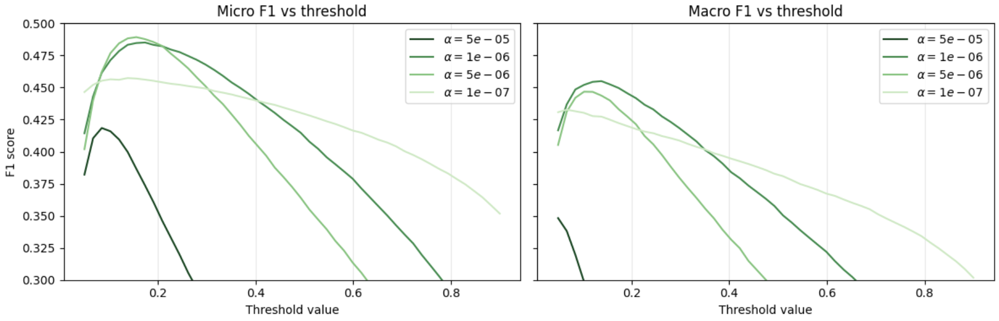

# ML Projects

This repository contains a collection of my machine learning projects.  
Projects are added incrementally and are designed to be self-contained, with a focus on clarity, evaluation, and end-to-end pipelines rather than isolated models.

The emphasis is on:
- Practical data preprocessing and feature engineering
- Interpretable baseline models
- Proper train / validation / test separation
- Quantitative metrics combined with qualitative error analysis

---

## Projects

### [Automatic Keyword Tagging for hep-ph Papers](hep_ph_keyword_tagging/main.ipynb)

A multilabel NLP project that predicts INSPIRE-style keywords for high-energy physics phenomenology (hep-ph) abstracts.

Key components include:
- Data collection via the INSPIRE API
- Keyword normalization and filtering
- TF–IDF feature extraction
- Logistic regression trained in a One-vs-Rest multilabel setting
- Threshold tuning using a dedicated cross-validation set
- Evaluation using micro-F1, macro-F1, and top-k metrics
- Qualitative error analysis on randomly selected abstracts

This project serves as a complete example of a **realistic multilabel NLP pipeline**, including label imbalance, sparsity, and threshold calibration.

<small>Figure: Micro- and macro-averaged F1 score as a function of the decision threshold for several values of the regularization parameter 𝛼. Performance is primarily controlled by the threshold choice, with both metrics peaking around thresholds 0.1−0.2. Variations in α have a comparatively minor effect once within a reasonable range, indicating that the model is not strongly sensitive to regularization. As expected, macro-F1 is systematically lower than micro-F1, reflecting the difficulty of predicting less frequent keywords.</small>

