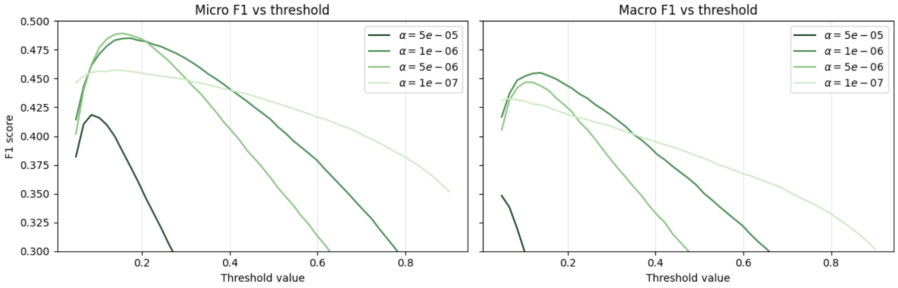
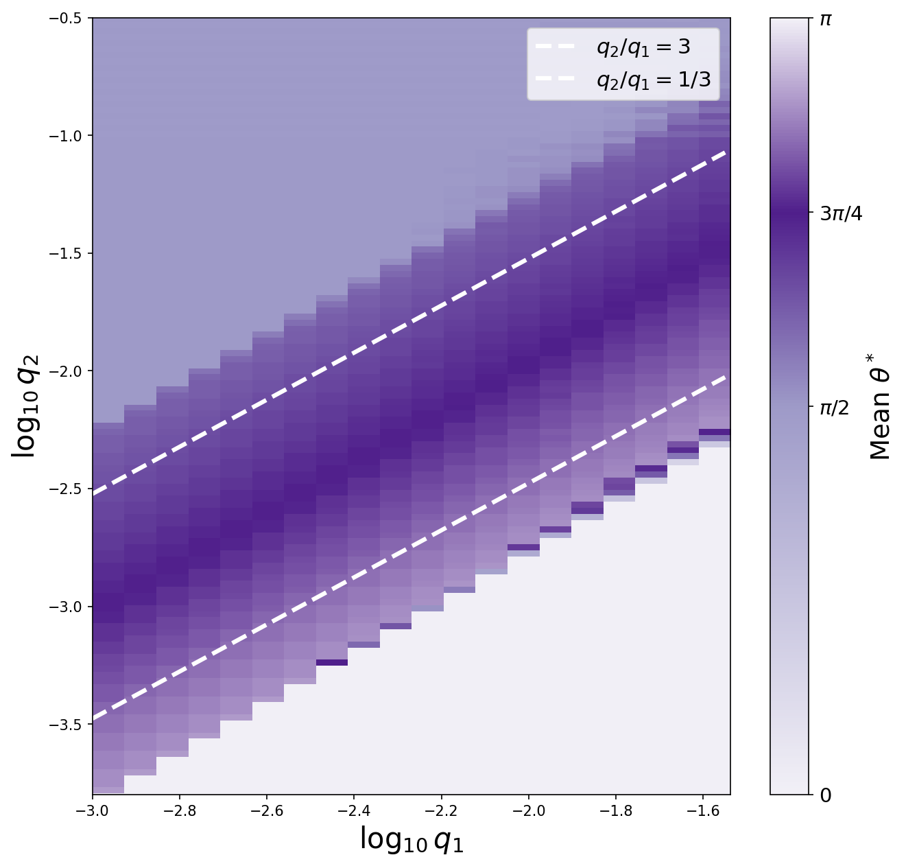

# ML Projects

A collection of machine learning projects with a focus on analytical rigour, interpretability, and end-to-end pipelines. Each project is self-contained and documented from data to results.

The emphasis is on:
- Practical data preprocessing and feature engineering
- Interpretable baseline models and closed-form analysis where possible
- Proper train / validation / test separation
- Quantitative metrics combined with qualitative error analysis

---

## Projects

### [Automatic Keyword Tagging for hep-ph Papers](hep_ph_keyword_tagging/main.ipynb)

A multilabel NLP project that predicts INSPIRE-style keywords for high-energy physics phenomenology (hep-ph) abstracts.

Key components include:
- Data collection via the INSPIRE API
- Keyword normalisation and filtering
- TF-IDF feature extraction
- Logistic regression trained in a One-vs-Rest multilabel setting
- Threshold tuning using a dedicated cross-validation set
- Evaluation using micro-F1, macro-F1, and top-k metrics
- Qualitative error analysis on randomly selected abstracts

This project serves as a complete example of a **realistic multilabel NLP pipeline**, including label imbalance, sparsity, and threshold calibration.

  

  <em>
  Micro- and macro-averaged F1 as a function of the decision threshold for several regularisation values. Performance is primarily controlled by the threshold, with both metrics peaking around 0.1-0.2. Macro-F1 is systematically lower than micro-F1, reflecting the difficulty of predicting rare keywords.
  </em>

---

### [Toy Models of Superposition: Linear and Nonlinear Analysis](superposition_toy_model/nonlinear_superposition_toy_model_v2.ipynb)

An analytical and numerical study of **feature superposition** in minimal autoencoders, extending the toy models from Elhage et al. (2022). The central question is when and why a neural network stores more features than it has neurons.

Both a linear and a nonlinear (ReLU) version are treated with fully closed-form expected-loss formulas, verified against Monte Carlo simulation. Key contributions include:
- Exact analytical derivation of the expected loss for both models, via closed-form auxiliary integrals over the ReLU nonlinearity
- Proof that superposition is impossible in the linear model (the non-trivial critical point is always a saddle)
- Three-phase structure for the ReLU model: feature 1 only, superposition, feature 2 only
- Identification of the **effective scarcity** $q_i = I_i p_i$ (importance times activity probability) as the natural parameter governing the phase boundaries at leading order in sparsity
- Numerical quantification of where and how this leading-order description breaks down at finite $p_i$

  

  <em>
  Phase diagram from a 64,000-point numerical scan. Colour shows the optimal weight angle &theta;*; dashed lines mark the analytical phase boundaries q&#8322;/q&#8321; = 1/3 and q&#8322;/q&#8321; = 3.
  </em>

