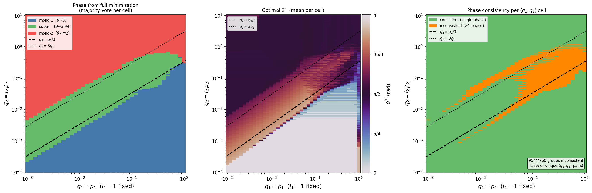

# Toy Models of Superposition — Linear & Nonlinear Analysis

Analytical study of **feature superposition** in minimal autoencoders, extending the toy models from Elhage et al. (2022). Both a linear and a nonlinear (ReLU) version are treated, with fully closed-form expected-loss formulas verified against Monte Carlo simulation.

> Elhage et al. (2022). *Toy Models of Superposition*. Transformer Circuits Thread.
> https://transformer-circuits.pub/2022/toy_model/index.html

---

## What is superposition?

Neural networks can represent **more features than they have neurons** by storing them in overlapping, near-orthogonal directions in activation space — a phenomenon called superposition. It is thought to underlie polysemanticity in large language models, where individual neurons respond to many unrelated concepts. Understanding when and why superposition occurs is a central question in mechanistic interpretability.

---

## Repository structure

| File | Description |
|:-----|:------------|
| `linear_superposition_toy_model.ipynb` | Analytical + numerical study of the **linear** model |
| `nonlinear_superposition_toy_model_v2.ipynb` | Analytical + numerical study of the **nonlinear (ReLU)** model |
| `Notes/ML_project.tex` | Full derivations in LaTeX |
| `Notes/ML_project.pdf` | Compiled PDF of the notes |
| `*.png` | Phase diagrams and validation figures |

---

## The model

Both notebooks study a one-hidden-unit autoencoder that compresses $n = 2$ features into $m = 1$ latent dimension:

$$h = wx, \qquad x' = f(w^T h + b)$$

where $w = (\cos\theta,\, \sin\theta)$ and $f$ is either the identity (linear) or ReLU (nonlinear).

**Input distribution.** Each feature $x_i$ is i.i.d.: zero with probability $1 - p_i$, $\text{Uniform}[0, 1]$ with probability $p_i$. The sparsity $p_i \ll 1$ is the key parameter enabling superposition.

**Loss.** Weighted MSE:

$$\mathcal{L} = \frac{1}{2} \sum_i I_i (x_i - x'_i)^2$$

For large batches $\mathcal{L}$ concentrates on its mean $E[\mathcal{L}]$, which is derived analytically in both cases.

---

## Key results

### Linear model — no superposition

The expected loss is a simple closed-form polynomial in $(\cos\theta, \sin\theta)$:

$$E[\mathcal{L}] = \frac{I_1 p_1 \sin^4\theta}{6} + \frac{I_2 p_2 \cos^4\theta}{6} + \cdots$$

Minimising first over the biases,

$$b_i^*(\theta) = -\frac{p_i}{2}(w^\top w)_{ii}$$

and then over $\theta$ reveals:

- The only local minima are $\theta = 0$ and $\theta = \pi/2$, each representing exactly **one** feature.
- A non-trivial stationary point $\theta^*$ exists but is always a **saddle**.
- **Superposition does not occur** in the linear model.

**Exact phase boundary:**

$$\frac{I_2}{I_1} = \frac{p_1 \left(1 - \tfrac{3}{4}p_1\right)}{p_2 \left(1 - \tfrac{3}{4}p_2\right)}$$

### Nonlinear (ReLU) model — superposition emerges

With a ReLU output the expected loss decomposes into four terms $A$–$D$ according to which features are active. Each term is computed exactly via closed-form auxiliary integrals:

$$F_n(\alpha,\beta) = \int_0^1 \mathrm{ReLU}(\alpha x + \beta)^n\,dx, \quad G(\alpha,\beta) = \int_0^1 x\,\mathrm{ReLU}(\alpha x + \beta)\,dx$$

and their iterated counterparts $\mathcal{F}_n$, $\mathcal{H}$, $\mathcal{G}$ for the case where both features are simultaneously active.

Minimising over $(\theta, b_1, b_2)$ reveals a **three-phase structure**. Since $\mathcal{L}$ scales linearly in $I_1$, the phase depends on only three free parameters: $I_2/I_1$, $p_1$, $p_2$. At leading order in $p_i$, the boundaries collapse further onto the single combination $q_i = I_i p_i$, the **effective scarcity** of each feature:

| Phase | Condition | Optimal θ | Interpretation |
|:------|:----------|:----------|:---------------|
| Feature 1 only | $q_2 < q_1/3$ | $0$ | Network stores feature 1, ignores feature 2 |
| **Superposition** | $q_1/3 < q_2 < 3q_1$ | $3\pi/4$ | Both features stored in antipodal directions |
| Feature 2 only | $q_2 > 3q_1$ | $\pi/2$ | Network stores feature 2, ignores feature 1 |

At $\theta = 3\pi/4$ the ReLU separates the two features: feature 1 activates the neuron positively, feature 2 activates it negatively, and the nonlinearity disambiguates them at readout. **This superposition minimum is absent in the linear model** — the ReLU is the minimal ingredient required.



Phase diagram from a $40^3 = 64{,}000$-point grid scan. Colour shows the numerically optimal $\theta^*$; dashed lines mark the predicted phase boundaries $q_2/q_1 \in \{1/3, 3\}$.

---

## Notebooks

### `linear_superposition_toy_model.ipynb`

| Section | Content |
|:--------|:--------|
| 1 | Closed-form $E[\mathcal{L}]$ validated against Monte Carlo |
| 2 | Analytical optimal biases $b^*(\theta)$ vs numerical minimisation |
| 3 | Loss landscape $E[\mathcal{L}]\|_{b^*}(\theta)$ at multiple sample sizes |
| 4 | Interactive sliders for $(I_1, I_2, p_1, p_2)$ *(local Jupyter only)* |
| 5–6 | Phase boundary verified for symmetric and asymmetric cases |

### `nonlinear_superposition_toy_model_v2.ipynb`

| Section | Content |
|:--------|:--------|
| 1 | Analytical $E[\mathcal{L}]$ via auxiliary integrals $F_n, G, \mathcal{F}_n, \mathcal{H}, \mathcal{G}$ |
| 2 | Monte Carlo validation at $N \in \{10^2, 10^4, 10^6\}$ samples |
| 3.1 | Collapse test: does $q_i = I_i p_i$ fully determine the phase? |
| 3.2 | Phase diagram in the $(q_1, q_2)$ plane; leading-order boundaries verified |
| 3.3 | Finite-$p$ corrections: phase boundaries in the $(p_1, p_2)$ plane at fixed $I_2$ |

---

## Setup

No deep learning framework required — only standard scientific Python:

```bash
pip install numpy pandas matplotlib
```

Run either notebook in Jupyter:

```bash
jupyter notebook nonlinear_superposition_toy_model_v2.ipynb
```

> **Note on the interactive section.** Section 4 of the linear notebook uses `%matplotlib notebook` widgets and requires classic Jupyter Notebook (not JupyterLab). All other sections produce static output and render correctly on GitHub or in any environment.

---

## Notes and derivations

Full derivations of all analytical results — including the auxiliary integrals and phase boundary calculations — are in `Notes/ML_project.tex` (compiled: `Notes/ML_project.pdf`).

---

## References

Elhage, N., Hume, T., Gray, C., Jacobsen, S., Hubinger, E., Olshausen, B., Bricken, T., Whittington, J., Cammarata, N., Goh, G., Henighan, T., Hernandez, D., Jones, A., Askell, A., Conerly, T., DasSarma, N., Drain, D., Ganguli, D., Hatfield-Dodds, Z., ... Olah, C. (2022). *Toy Models of Superposition*. Transformer Circuits Thread. https://transformer-circuits.pub/2022/toy_model/index.html
